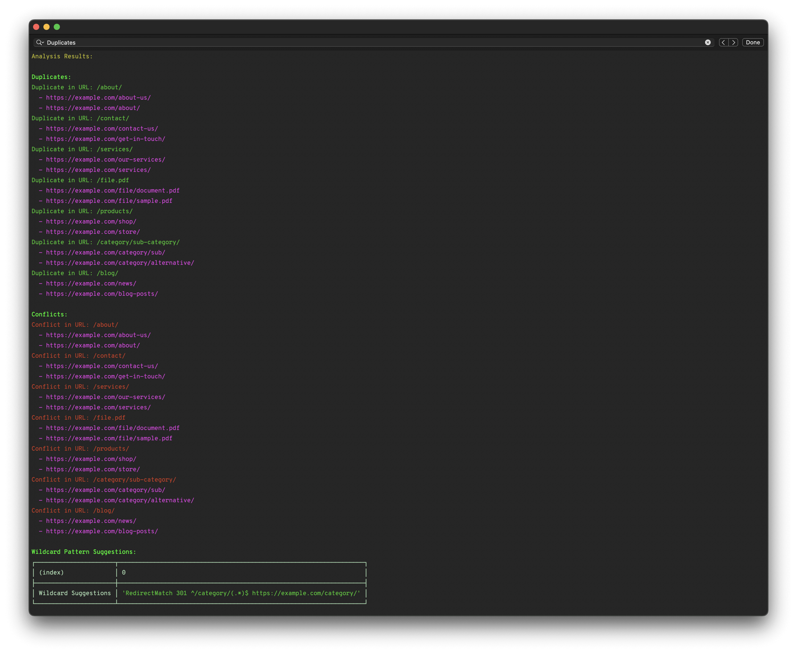

Analyze Redirects
==========

[](https://www.npmjs.com/package/@danielhaim/analyzeredirect)
[](https://www.npmjs.com/package/@danielhaim/analyzeredirect)




Overview
--------

`AnalyzeRedirects` is a tool for analyzing URL redirects, identifying duplicates and conflicts, and generating `.htaccess` or `.nginx` style redirect rules.

Installation
------------

Install `AnalyzeRedirects` using NPM:

```shell
npm i @danielhaim/analyzeredirects
```

2. Link the Package Locally
If you're working on the project locally and want to test your changes in your environment, use `npm link`:

```shell
npm link
```

3. Linking in another project
If you want to link this package into another project for testing or development, you can use this command inside the target project:

```shell
npm link @danielhaim/analyzeredirects
```

### API Documentation ###
Once installed, you can use the command-line interface (CLI) to analyze your redirects and generate `.txt` files with the rules. Here's how to use it:

```bash
# If you have linked the package locally:
analyze-redirects --file <path_to_your_json_file> [options]

# If you installed the package normally:
npx analyze-redirects --file <path_to_your_json_file> [options]
```

### Options:
- `-f`, `--file <path>`: Path to JSON file with Old_URL and New_URL.
- `-o`, `--output <path>`: Path to output the generated redirects file (default: `./dist/redirects.txt`).
- `-a`, `--analyze-only`: Only analyze redirects without generating output file.
- `-s`, `--silent`: Suppress console output.
- `-h`, `--help`: Display this help message.

### Examples:

To analyze redirects and see the output in the console:

```bash
analyze-redirects --file ./__test__/demo-urls.json
```

To generate a file with the redirects:

```bash
analyze-redirects -f ./__test__/demo-urls.json -o ./output-redirects.txt
```

To analyze without generating a file:

```bash
analyze-redirects --file ./__test__/demo-urls.json --analyze-only
```

### Adding a New URL Set

To add a new set of redirects, create a urls.json file in the ./sets/ directory with the following structure:
```json
[
    { "Old_URL": "/old-page", "New_URL": "https://example.com/new-page" },
    { "Old_URL": "/another-page", "New_URL": "https://example.com/another-page" }
]
```

Once your set is added, you can analyze it using the CLI by specifying the path to your `urls.json` file.

License
-------

This software is released under the [MIT License](LICENSE)

Report Issues or Request a Feature
----------------------------------

If you encounter any issues or have suggestions for improvements, please feel free to report them. Your feedback is invaluable in enhancing this software.

Folder Structure
----------------

Here's an overview of the project's folder structure:

```bash
.
├── LICENSE
├── README.md
├── __test__
│   ├── analyzeredirects.test.js
│   ├── demo-redirects.txt
│   ├── demo-urls.json
│   └── expected-demo-redirects.txt
├── babel.config.js
├── cli.js
├── index.js
├── jest.config.mjs
├── package-lock.json
├── package.json
├── sets
│   └── urls.json
└── src
    ├── index.js
    └── util.analyze.js
```

- `__test__`: Contains test files and sample data.
- `cli.js`: The CLI entry point.
- `sets/urls.json`: Default set for analysis, you can add your own sets here.
- `src/`: Source code for redirect analysis and utilities.